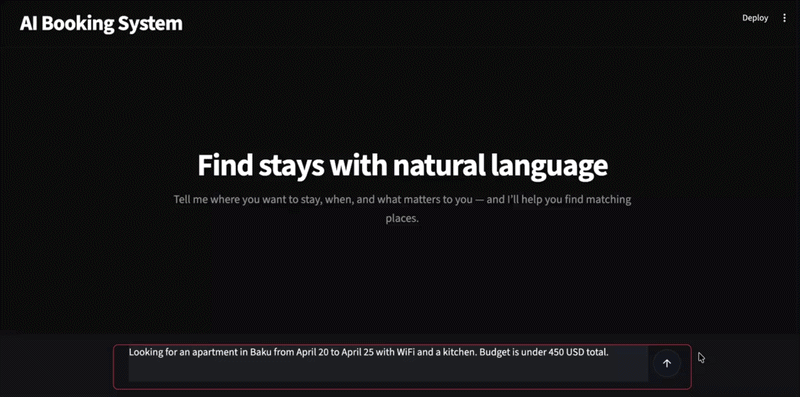
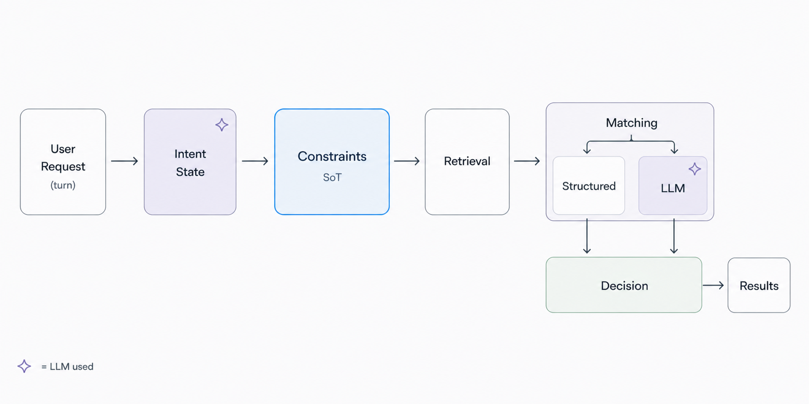

# Booking AI System

Constraint-aware conversational booking assistant with deterministic decision-making and controlled LLM usage.

<p align="center">
  
</p>


## Problem

LLM-based systems are inherently non-deterministic and struggle to reliably enforce strict user requirements  
(e.g., "must have WiFi", "no smoking", "under $100").

In real-world applications:

- constraints must be strictly respected  
- decisions must be explainable  
- failures must be controlled  


## Architecture

<p align="center">
  
</p>

Constraint-centric conversational pipeline with deterministic decision layer.


### Pipeline

User Request  
→ Intent State  
→ Constraints (SoT)  
→ Retrieval  
→ Matching  
→ Decision  
→ Results  


### Key principles

- Constraints are the **source of truth**
- Intent is maintained as a **multi-turn evolving state**
- LLM is used only for **signal / evidence extraction**
- Final decisions are **deterministic and auditable**


### Matching layer

- Structured → exact constraint checks  
- LLM → fallback evidence extraction  

Final decision is always made in the deterministic layer.


## How it works

1. User request is parsed into intent  
2. Intent is updated across turns (multi-turn support)  
3. Constraints are extracted and normalized  
4. Listings are retrieved  
5. Matching is performed:
   - structured checks  
   - textual rules  
   - LLM fallback (only if needed)  
6. Deterministic decision layer resolves:
   - YES / NO / UNCERTAIN  
7. Results are filtered, ranked, and returned with explanations  


## Evaluation

### Constraint Resolution (120 cases)

- Accuracy: **0.86**  
- YES F1: **0.87**  
- NO F1: **0.91**  
- UNCERTAIN F1: **0.79**

Critical errors:

- NO → YES: **0 cases**  
- YES → NO: **0 cases**

Insight:  
System is safe (no constraint violations), but slightly conservative.


### Ranking Layer

- Exact match rate: **0.97**  
- Top-1 accuracy: **0.98**  
- Ineligible leak rate: **0.0**

Insight:  
Deterministic ranking is highly stable and reliable.


### End-to-End

- Scenarios:
  - happy path  
  - constraint blocking  
  - no results  
  - multi-turn updates  

Status: in progress


## Observability

Every request generates a structured telemetry trace that captures the execution of the pipeline.

Each trace includes:

* trace ID
* total request latency
* latency for every pipeline step
* LLM calls
* token usage
* estimated cost
* external API calls
* fallback usage
* execution scenario


### Telemetry Dashboard

The project includes a Streamlit dashboard for inspecting telemetry logs.

The dashboard provides:

* request overview
* latency distribution
* P50 / P95 / P99 latency
* latency by pipeline step
* slowest requests
* trace viewer
* LLM usage and token statistics
* estimated request cost
* fallback / router / Apify usage
* raw telemetry explorer

This makes it easy to identify performance bottlenecks, inspect individual traces, and monitor system behavior during development.


## Project Structure

```text
app/
├── agents/          # intent routing & updates (LLM)
├── logic/           # deterministic decision logic
├── retrieval/       # listings retrieval
├── observability/   # telemetry collection (latency, cost, traces)
├── schemas/         # data models
├── services/        # external integrations
├── tools/           # pipeline orchestration
├── config/          # settings
└── resources/       # reference data (e.g. fx rates)

ui/
└── streamlit_app.py # demo entry point

dashboards/
└── telemetry_dashboard.py # telemetry visualization

evaluation/
├── core/
├── tasks/
└── outputs/

scripts/             # debug / smoke / experiments

tests/
fixtures/
assets/
```


## Tech Stack

- Python  
- asyncio  
- Gemini API (LLM)  
- Apify (retrieval)  
- Pytest  
- Streamlit  

## Running Locally

### 1. Install dependencies

```bash
uv sync
```

### 2. Setup environment

```bash
cp .env.example .env
```

Fill in your API keys in `.env`:

```env
GEMINI_API_KEY=...
APIFY_TOKEN=...
```

### 3. Run demo (Streamlit UI)

```bash
uv run streamlit run ui/streamlit_app.py
```

### 4. Run telemetry dashboard
```bash
uv run streamlit run dashboards/telemetry_dashboard.py
```

### 5. Run tests

```bash
uv run pytest
```


## Latency & Cost

Typical request:

- Retrieval (Apify): **40–80 sec**  
- LLM fallback: **5–15 sec**  
- Internal pipeline: **<5 sec**

Cost:

- LLM: low (few cents per request)  
- Apify: ~0.0025 USD per call  

Insight:

- LLM usage is minimized  
- expensive steps are isolated  
- full telemetry is available  


## Example

User:

"Apartment in Barcelona, June 15–20, under $100, must have WiFi"

System:

- extracts constraints  
- updates intent  
- retrieves listings  
- applies matching  
- makes deterministic decision  
- returns explainable results  


## Future Work

- End-to-end evaluation completion  
- Improve constraint extraction recall  
- Query rewriting layer  
- Natural language response layer (on top of deterministic core)  

