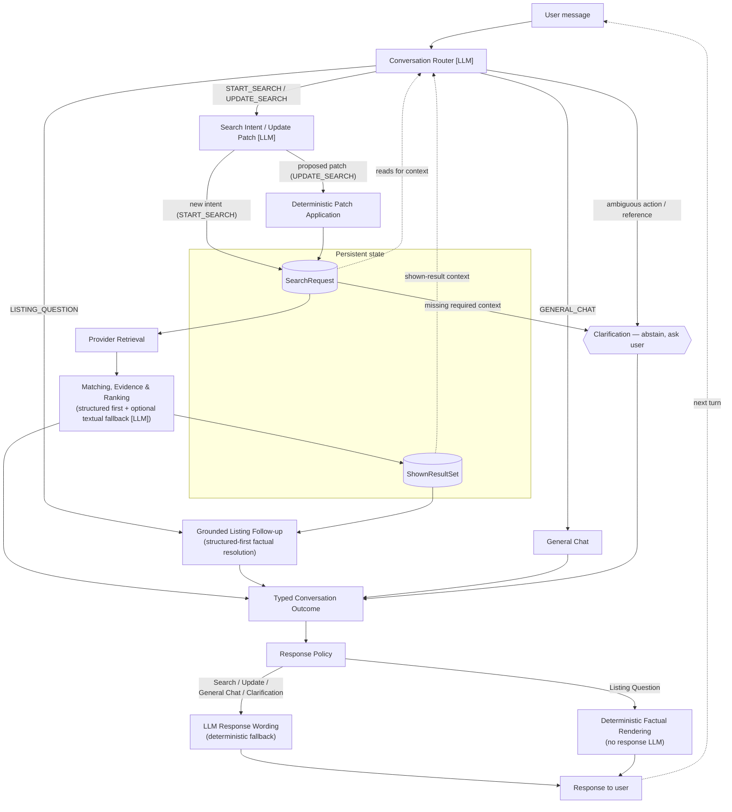
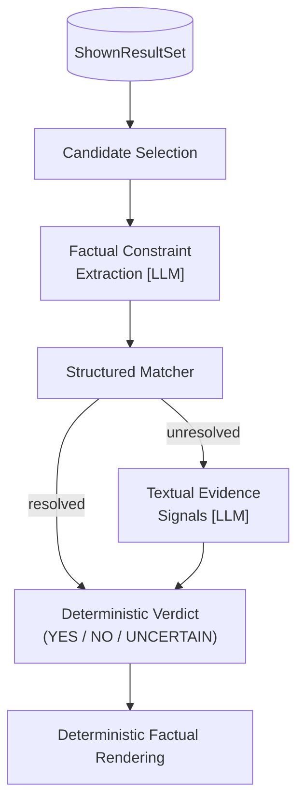

# Booking AI System

A multi-turn conversational system for accommodation search, built around explicit conversation state and typed contracts rather than an open-ended chat loop. LLMs interpret language and evidence — including intent, ambiguous references, and unstructured listing text — while deterministic code owns state transitions, eligibility, and final listing-fact verdicts.

## Architecture Overview



Every user message is first classified by a Conversation Router into one of four actions — `START_SEARCH`, `UPDATE_SEARCH`, `LISTING_QUESTION`, `GENERAL_CHAT`. Clarification isn't a fifth action: it's a short-circuit taken whenever the system should abstain rather than guess.

`START_SEARCH` builds a new persistent search state; `UPDATE_SEARCH` has the LLM propose a patch that deterministic code merges into it. A ready state runs through retrieval, matching, and ranking, while `LISTING_QUESTION` answers against the snapshot of what was just shown, not the chat transcript. Resolved domain flows converge into typed outcomes before rendering, with response policy depending on the outcome type.

### Key engineering decisions

- **Explicit, persisted state contracts** for search intent and shown results, not implicit chat history
- **Patch-based state updates** — the LLM proposes, deterministic code applies
- **Abstention over guessing** on genuinely ambiguous turns
- **Deterministic validation** of any LLM-resolved identity against real state
- **Structured-first evidence resolution**, with free-text LLM evidence as a narrow fallback
- **Deterministic factual verdicts and rendering** for listing follow-ups — never LLM-paraphrased

## Conversation State

Two separate objects carry state across turns, because they answer different questions.

### `SearchRequest`

Persistent semantic representation of what the user currently wants. Updates happen through deterministic patch application rather than raw state replacement by the LLM.

### `ShownResultSet`

Snapshot of exactly the listings exposed by the latest executed search. Preserves stable result identity and the listing data required for follow-up questions.

`SearchRequest` owns *intent*; `ShownResultSet` owns *referential context*. For a reference like "the second one," the router resolves it semantically, and the resulting target identity is validated deterministically against the actual `ShownResultSet`. A newly executed search replaces the shown-result snapshot; read-only turns leave it untouched.

## Grounded Listing Follow-ups

When a user asks about something already shown — "Does the second one have parking?", "Which of these has a balcony?" — the question isn't handed to a single LLM to answer. It moves through a short pipeline, and only two narrow, clearly-scoped steps in it ever touch an LLM.



- Candidates come from `ShownResultSet` — the persisted snapshot of exactly what was shown, never re-derived or re-ranked here.
- An LLM turns the question into one or more factual constraints — its first role is interpreting the question, not answering it.
- Each constraint is checked first by a structured matcher against listing fields; if that resolves it, nothing further runs.
- Only constraints the structured matcher can't resolve go to a second LLM call, which reads the listing's free text and returns evidence signals — support, contradiction, or insufficient evidence — not a verdict.
- A separate, deterministic decision layer reduces those signals to the final `YES` / `NO` / `UNCERTAIN`.
- The answer is rendered directly from that verdict — this outcome deliberately bypasses the conversation-response LLM, so a decided fact can't be reinterpreted before reaching the user.

An LLM may interpret which shown result a reference points to, but that's never trusted without deterministic validation against `ShownResultSet`. No LLM in the factual-resolution path decides the final verdict or composes the answer once that verdict exists.

The current flow is exercised by unit tests and manual smoke scripts; a dedicated scored evaluation has not yet been added.

## Evaluation

Three core components are evaluated separately against hand-labeled golden sets; the numbers below come from the current saved reports.

| Area | What it measures | Current result | Evaluation set |
|---|---|---|---|
| [Constraint extraction](evaluation/outputs/constraint_extraction_report.json) | Natural-language request → structured search constraints | F1 ≈ 0.79, exact-set match ≈ 0.80 | n = 166 |
| [Constraint resolution](evaluation/outputs/constraint_resolution_eval_report_new_ver3.json) | Listing evidence → `YES` / `NO` / `UNCERTAIN` decision | ≈ 0.86 accuracy on 114 valid cases; 0 observed critical YES↔NO flips | n = 120 attempted, 114 valid |
| [Ranking & selection](evaluation/outputs/ranking_selection_eval_report.json) | Which eligible listings are surfaced, and in what order | top-1 ≈ 0.98; 0/103 cases contained an ineligible-listing leak | n = 103 |

`LISTING_QUESTION` factual resolution is covered by unit and smoke tests but does not yet have a dedicated scored evaluation. A router benchmark predates the latest routing-boundary changes, a reference-resolution dataset has no saved scored report, and the end-to-end benchmark's ground truth is under revision, so their numbers are not shown here.

## Observability

Every user turn produces a request-level trace covering per-step latency, LLM calls, available token usage, estimated cost, external calls, and success/failure metadata.

- Traces are appended locally to `logs/telemetry/telemetry_YYYY-MM-DD.jsonl`
- A separate Streamlit dashboard (`dashboards/telemetry_dashboard.py`) supports latency, cost, and usage analysis
- This is local developer observability, not a hosted monitoring backend

## Experimental Track

A separate research track explores embedding-based evidence retrieval, evidence cleanup, and semantic verification for subjective, natural-language preferences ("quiet", "good for remote work") that can't be checked against structured fields alone. An opt-in shadow integration exists in the application code, but current application entry points leave it disabled, so it does not affect user-visible results. Offline experiments also compare the LLM-based verifier against a DeBERTa NLI model. Details live in [`evaluation/experiments/verifier_comparison`](evaluation/experiments/verifier_comparison/README.md).

## Getting Started

### Repository structure

```text
app/                  application logic — routing, state, matching, evidence resolution
ui/                   Streamlit chat interface
evaluation/
  datasets/           hand-labeled evaluation data
  tasks/              scored, repeatable evaluation runners
  experiments/        research tracks: embeddings, NLI, soft evidence
scripts/              debug, development, and ad hoc utilities
tests/                unit and integration tests
dashboards/           telemetry dashboard
fixtures/             offline demo listing data
```

### Running locally

```bash
uv sync                                                    # install dependencies
cp .env.example .env                                       # configure provider credentials
uv run streamlit run ui/streamlit_app.py                   # run the app (uses local fixture listings by default)
uv run pytest                                               # optional: run tests
uv run streamlit run dashboards/telemetry_dashboard.py      # optional: telemetry dashboard
```

Python, Pydantic, Streamlit, Gemini/Groq, Apify, pytest.

## Status / Limitations

- Complete LISTING_QUESTION factual flow has unit/smoke coverage but no dedicated scored evaluation yet.
- Search/general-chat/clarification response wording is LLM-composed over already-decided outcomes, with deterministic fallback but no separate post-generation factual verifier.
- Soft-evidence/embedding pipeline exists but is disabled in current application traffic and has not been validated as a live decision-making path.
