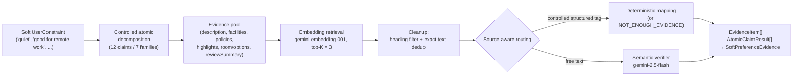

# Booking AI System

Constraint-aware booking assistant with multi-turn search state, deterministic eligibility decisions, and evidence-grounded resolution of natural-language preferences.

<p align="center">
  
</p>

## Problem

LLM-based systems are inherently non-deterministic and can struggle to reliably enforce strict user requirements
(e.g. "must have WiFi", "no smoking", "under $100").

In a booking assistant:

* hard constraints must be respected
* search state must remain consistent across turns
* decisions should be explainable
* LLM failures must not silently corrupt application state
* expensive or probabilistic components should be isolated and measurable

## Architecture

The system separates conversational routing, structured search state, probabilistic evidence extraction, and deterministic domain decisions.

### High-level flow

```text
User Message
    ↓
Conversation Router
    ↓
Action Dispatch
    ├── start_search
    │      ↓
    │   SearchRequest extraction
    │      ↓
    │   Search pipeline
    │
    ├── update_search
    │      ↓
    │   Existing SearchRequest update
    │      ↓
    │   Search pipeline
    │
    ├── listing_question
    │      ↓
    │   Listing Q&A path
    │
    └── general_chat
           ↓
       Non-search response
```

For search actions:

```text
SearchRequest
    ↓
Constraints
    ↓
Retrieval
    ↓
Matching
    ↓
Deterministic Eligibility Decision
    ↓
Ranking
    ↓
Results
```

### Key principles

* `SearchRequest` is the canonical source of truth for the active search state
* Constraints are the source of truth for semantic user requirements
* LLMs are used for narrow tasks such as routing, intent extraction/update, and textual evidence resolution
* Python controls application flow and state transitions
* Final listing eligibility decisions are deterministic and auditable
* LLM failures are handled separately from domain state updates
* LLM components are evaluated independently before being used in the pipeline
* probabilistic evidence-resolution logic is isolated behind an explicit opt-in shadow layer until it is validated against live data

### Matching layer

Matching combines deterministic checks with controlled LLM usage, at increasing levels of ambiguity:

1. **Structured listing data → exact deterministic checks.** Hard fields (price, dates, property type) are compared directly, with no LLM involved.
2. **Textual evidence → rules when possible, LLM fallback otherwise.** This is the original path, still active in production for constraints not covered by the newer evidence pipeline below: deterministic rules resolve what they can, and a broader LLM call resolves whatever remains in a single decision.
3. **Soft, natural-language preferences → evidence-aware resolution (shadow-mode).** A separate internal layer decomposes a soft preference ("quiet", "good for remote work") into atomic claims, retrieves candidate evidence with embeddings, and routes each candidate to either a deterministic mapping or a narrow semantic verifier. Described in detail in [Evidence-aware soft preference resolution](#evidence-aware-soft-preference-resolution) below. This layer is currently integrated as an explicit opt-in shadow path — it does not control the results returned to a user by default.

Across all three levels, the LLM (when used) extracts, classifies, or verifies evidence — it never makes the final eligibility decision itself, which stays in deterministic Python. For level 3 specifically, responsibility is split narrowly on purpose:

| Component | Responsibility |
|---|---|
| Embeddings (`gemini-embedding-001`) | Find potentially relevant listing evidence for an atomic claim. This establishes topical relevance, not truth. |
| Strict structured routing | Resolve controlled structured evidence (e.g. a `facilities[].name` tag) deterministically, without an LLM, wherever a validated mapping exists. |
| Semantic verifier (`gemini-2.5-flash`) | Judge whether **one** free-text evidence snippet supports, contradicts, or does not establish **one** atomic hypothesis. |
| Python | Aggregates evidence across claims and controls all application state; the LLM never writes application state directly. |

### Evidence-aware soft preference resolution

Hard constraints and rule-coverable textual evidence continue to flow through the matching layer above, unchanged. Difficult natural-language preferences — the ones that require reading free text and judging whether it actually supports a claim, not just whether it mentions the right topic — now have a separate, dedicated evidence-resolution path.

This path is implemented and integrated into `evaluate_listings`, but strictly as a **shadow layer**: it is disabled by default, runs only when a caller explicitly passes an enabled `SoftEvidencePipelinePolicy`, and — when it does run — only *attaches* its output (`soft_preference_evidence`) to a listing for inspection. It never changes scoring, filtering, ordering, or the constraint-resolution results that determine what a user sees. `orchestrate_search_request`, the entry point for normal search requests, never passes this policy, so the public `NormalizedSearchResponse` is unaffected. In its current form, this is an evidence-collection and observability layer, not a live ranking signal.



#### Atomic decomposition

A soft preference is not resolved as one broad claim. It is decomposed, up front, into **12 atomic claims across 7 semantic families** — quiet, remote work, family friendly, breakfast quality, cleanliness, nightlife nearby, and bed comfort. For example:

* "good for remote work" → desk / dedicated workspace, Wi-Fi availability, and internet reliability as three separate, independently-checkable claims
* "quiet" → soundproofing, quiet surroundings, and guest-reported noise as three separate claims

This decomposition is a fixed, hand-authored keyword-to-claim lookup, not something an LLM invents per request — the same soft preference always maps to the same fixed set of atomic claims, which is what keeps the rest of the pipeline auditable.

#### Evidence sources

The evidence pool for a listing is built from: description, facilities, room facilities, policies, highlights, room/options text, and other listing signals (fine print, etc.), plus — when present — Booking's `reviewSummary` pros/cons guest-review aggregate.

`reviewSummary` entries are treated as plain text evidence only. Being grouped under "pros" vs. "cons", or carrying a sentiment/mention-count field, does **not** automatically decide the semantic relation — that relation is still decided only by routing and the verifier, the same as any other free-text candidate.

#### Retrieval

Atomic-claim queries are embedded once per request (a single batched call covering all claim IDs) and reused across every listing evaluated in that request, rather than being recomputed per listing. Each listing's full evidence pool is embedded in batches of at most 100 items, and candidates are ranked against each claim query by cosine similarity, keeping the top 3 per claim.

After retrieval, two cleanup steps run before anything is routed: a heading filter drops candidates whose source path is a structural heading rather than prose (e.g. a `"Children and beds"` section title retrieved as if it were a sentence), and exact-text deduplication collapses repeated boilerplate strings that appear at multiple source paths, keeping the best-scoring representative. Every surviving evidence item retains its `retrieval_score`.

#### Strict structured routing

One of the more important design decisions in this pipeline: a controlled structured field is not automatically trusted to answer every claim it is topically related to.

* Controlled structured field (a `facilities[].name` or `rooms[].facilities[].name` tag) with a validated alias mapping for this claim → deterministic resolution, no LLM call.
* The same kind of controlled structured field with **no** mapping for *this specific claim* → resolved to `NOT_ENOUGH_EVIDENCE` for that evidence item, still without calling the LLM. The system does not ask the verifier to speculate about a structured tag outside its validated vocabulary.
* Everything else (description prose, highlights, policies, room/options text) is free text and goes to the semantic verifier.

Concretely: `"Free WiFi"` is a controlled facility tag that deterministically supports the "Wi-Fi available" claim — but it has no mapping for, and therefore does not establish, the separate "reliable internet for remote work" claim. Any evidence for that second claim still has to go through the semantic verifier and earn its own answer, rather than inheriting one from a shortcut that was never validated for it.

#### Semantic verification

Free-text candidates are judged by **Gemini 2.5 Flash**, one call per (atomic hypothesis, evidence snippet) pair. The model returns a structured relation — `SUPPORT`, `CONTRADICT`, or `NOT_ENOUGH_EVIDENCE` — plus a short reason, and is not shown any other candidate for context.

At the aggregated claim level, a fourth outcome, `MIXED`, is possible when both supporting and contradicting evidence were found for the same claim — it is deliberately not collapsed into either side.

Technical failures are kept distinct from a genuine lack of evidence, at two levels:

* **Retrieval status** (`SUCCESS` / `PARTIAL` / `FAILED`) — whether the embedding step behind a claim's evidence technically completed.
* **Evidence resolution status** (`resolved` / `verification_failed` / `skipped_call_limit`) — whether a specific evidence item's relation was actually determined, versus a verifier call that errored or was skipped because a per-request verifier-call budget was exhausted.

A resolved `NOT_ENOUGH_EVIDENCE` (the evidence exists and genuinely says nothing) is never conflated with a failed or skipped call (nothing was actually decided) — both remain visible and distinguishable downstream.

## How It Works

1. Every user message is classified by the Conversation Router as:

   * `start_search`
   * `update_search`
   * `listing_question`
   * `general_chat`

2. Search actions create or update a structured `SearchRequest`

3. Required search context is validated and missing information is requested when needed

4. User requirements are extracted and normalized into constraints

5. Listings are retrieved

6. Matching is performed using:

   * structured checks
   * textual rules
   * LLM fallback only when evidence cannot be resolved deterministically

7. The deterministic decision layer resolves listing eligibility:

   * YES
   * NO
   * UNCERTAIN

8. Eligible listings are filtered and ranked

9. Structured results and explanations are returned to the UI

When explicitly enabled by a caller (not the default path), a shadow evidence-resolution pass can additionally run per listing for observability purposes, without altering the results from steps 6–9.

## Evaluation

The system is evaluated at multiple independent layers rather than relying only on end-to-end metrics.

### Constraint Extraction (166 cases)

Evaluates whether user requirements are correctly extracted and represented as structured constraints.

* Precision: **0.78**
* Recall: **0.79**
* F1: **0.79**
* Exact constraint set match: **0.80**
* Exact full-case match: **0.66**
* Priority accuracy on matched constraints: **0.92**
* Category accuracy on matched constraints: **0.93**

**Insight:**
Constraint detection is generally reliable, while mixed-priority and multi-constraint requests remain the main source of extraction errors.

### Constraint Resolution (120 cases)

Evaluates the final YES / NO / UNCERTAIN decision for individual constraints based on available listing evidence.

* Valid evaluated cases: **114 / 120**
* Runtime errors: **6**
* Accuracy on valid cases: **0.86**
* YES F1: **0.88**
* NO F1: **0.92**
* UNCERTAIN F1: **0.79**

Critical errors observed in the valid evaluated set:

* NO → YES: **0 cases**
* YES → NO: **0 cases**

**Insight:**
No critical NO → YES or YES → NO errors were observed in the evaluated cases. Most remaining errors involve uncertainty handling rather than direct decision reversals.

### Evidence Retrieval & Semantic Verification

Separately from the constraint-resolution evaluation above, the evidence-aware soft-preference layer (see [Architecture](#evidence-aware-soft-preference-resolution)) went through its own independent evaluation track, in stages:

1. embedding-only evidence retrieval, broad query vs. atomic query
2. atomic decomposition of soft preferences into checkable claims
3. an oracle NLI experiment, isolating verifier quality from retrieval quality
4. end-to-end retrieval + verification together
5. heading-filter and exact-text-dedup cleanup
6. strict structured routing for controlled fields
7. a frozen, held-out semantic challenge benchmark
8. a Gemini-2.5-Flash vs. DeBERTa verifier comparison on that benchmark

Full methodology, all raw numbers, and documented limitations live in [`evaluation/experiments/verifier_comparison/README.md`](evaluation/experiments/verifier_comparison/README.md). The headline numbers below are pulled from that document's tracked, committed results.

**DEV / regression set** (4 Baku properties used while iterating on the pipeline — a DEV/regression signal, not an unbiased production metric):

* Embedding retrieval Recall@1 rose from **0.56** (one broad query per preference) to **0.93** (one query per atomic claim), reaching **1.0** on an expanded 40-subclaim regression set once atomic queries were adopted throughout.
* Strict structured routing at K=1, over that same 40-subclaim set: **TP = 16, FP = 0, FN = 0, TN = 24** — every structured-tag routing decision matched its expected label, with zero false SUPPORT.

**Held-out semantic challenge benchmark** (frozen, N=65; 19 properties across two cities, disjoint from the DEV set above): a primary high-confidence subset of **n=53** was used for the headline comparison. On that subset:

| Verifier | Accuracy | Macro F1 |
|---|---|---|
| DeBERTa-v3-large (self-hosted NLI model) | 0.868 | 0.872 |
| Gemini 2.5 Flash | 0.868 | 0.861 |

The benchmark is small (N=65, 9 CONTRADICT examples) and the two verifiers are statistically indistinguishable at this sample size — there is no proven winner. Gemini 2.5 Flash was selected for integration because it matches DeBERTa's benchmark quality while being materially simpler to deploy for this project: no self-hosted model, no GPU/CPU inference runtime, and no separate model-hosting responsibility.

**Insight:**
Atomic decomposition, not a better verifier, produced the single largest measured retrieval improvement. Once retrieval was solved, the remaining error surface for both strong verifiers was compositional (e.g. mistaking a narrow "family-friendly restaurant" mention for whole-property suitability) rather than simple topic mismatch.

### Conversation Router (70 cases)

Evaluates classification of each user turn into:

* `start_search`
* `update_search`
* `listing_question`
* `general_chat`

Each case was executed three times per model to measure both correctness and consistency.

Baseline benchmark before the final routing-boundary prompt fixes:

**Gemini 2.5 Flash Lite**

* Accuracy: **0.986**
* Macro F1: **0.984**
* Majority-vote accuracy: **0.986**
* Consistency: **1.00**
* Median latency: **~1009 ms**

**Groq GPT-OSS 20B**

* Accuracy: **0.976**
* Macro F1: **0.973**
* Majority-vote accuracy: **0.971**
* Consistency: **0.957**
* Median latency: **~548 ms**

Groq provided slightly lower routing accuracy but substantially lower latency and estimated cost, and is currently used as the preferred router model.

After the final routing-boundary prompt changes and structured-output integration, the four previously failing regression cases were rerun three times each on Groq:

* **12 / 12 predictions correct**

A new full 70-case benchmark has not yet been recorded for the updated prompt.

**Insight:**
A lower-cost task-specific model can be sufficient for routing when the action space and output contract are tightly constrained and evaluated independently.

### Ranking Selection (103 cases)

Evaluates deterministic selection and ordering after listing eligibility has already been established.

* Exact ranking match rate: **0.97**
* Selected-set match rate: **1.00**
* Top-1 accuracy: **0.98**
* Ineligible leak rate: **0.00**
* Tier violation rate: **0.019**

**Insight:**
The deterministic ranking layer is highly stable and did not leak ineligible listings in the evaluation set.

### End-to-End (50 cases)

End-to-end evaluation covers the complete pipeline from user query to final listing selection.

The current dataset contains positive, negative, and uncertain scenarios.

**Status: under revision**

An initial evaluation run exists, but its ground truth is not considered reliable enough to use as a project-quality benchmark.

The dataset and evaluation contract are being revised before end-to-end metrics are treated as authoritative.

## Observability

Every request generates a structured telemetry trace that captures execution across the pipeline.

Each trace includes:

* trace ID
* total request latency
* latency for individual pipeline steps
* LLM calls
* token usage
* estimated LLM cost
* external API calls
* fallback usage
* router usage
* execution scenario

When the evidence-aware soft-preference shadow layer is enabled for a request, its trace additionally records:

* embedding calls and per-call latency
* semantic verifier calls, per-call latency, and LLM token usage
* estimated verifier cost per hotel (kept as `None`, not `0.0`, when no call in the batch had a known cost — a technical-failure case is never silently reported as free)
* parse and API failures
* retrieval status counts (`SUCCESS` / `PARTIAL` / `FAILED`)
* verifier calls skipped due to the per-request call budget
* per-request claim-relation distributions, including `MIXED`
* bounded per-hotel shadow evidence detail, for inspecting individual disagreements

**Known limitation:** a live check against the Gemini Developer API showed that `gemini-embedding-001` responses do not populate the token-count statistics this integration expects. Embedding token usage and cost are therefore recorded as `None`/unknown rather than estimated from input string length.

### Telemetry Dashboard

The project includes a Streamlit dashboard for inspecting telemetry logs.

The dashboard provides:

* request overview
* latency distribution
* P50 / P95 / P99 latency
* latency by pipeline step
* slowest requests
* trace viewer
* LLM usage and token statistics
* estimated request cost
* fallback / router / Apify usage
* raw telemetry explorer
* **Soft Evidence (shadow)** — relation and resolution-status counts, retrieval-status counts, verifier call/latency/token/cost/parse-failure stats, and per-request shadow evidence detail, for any request where the soft-preference shadow layer ran

This makes it possible to inspect individual traces, identify performance bottlenecks, and monitor LLM and external-service usage during development.

## Project Structure

```text
app/
├── agents/          # task-specific LLM agents
├── config/          # application settings and LLM profiles
├── llm/             # provider-independent LLM model construction
├── logic/           # application and deterministic domain logic
├── observability/   # telemetry, latency, cost, and traces
├── retrieval/       # listing retrieval
├── schemas/         # typed application and domain contracts
├── services/        # external integrations
├── tools/           # search pipeline orchestration
└── resources/       # reference data

ui/
├── components/
├── services/
├── state.py
└── streamlit_app.py

dashboards/
└── telemetry_dashboard.py

evaluation/
├── core/
├── datasets/
├── tasks/
├── outputs/
└── experiments/     # soft-evidence research track: retrieval, NLI oracle, verifier comparison

scripts/
tests/
fixtures/
assets/
```

## Tech Stack

* Python 3.11+
* Pydantic
* asyncio
* Google ADK
* LiteLLM
* Gemini API
* Groq API
* Apify
* Streamlit
* Pytest
* uv

## Running Locally

### 1. Install dependencies

```bash
uv sync
```

### 2. Configure environment

Copy the example environment file:

```bash
cp .env.example .env
```

Configure the LLM providers used by the application:

```env
GOOGLE_API_KEY=...
GROQ_API_KEY=...
```

The Conversation Router can use the Groq profile:

```env
ROUTER_LLM_PROFILE=groq_gpt_oss_20b
```

The current Streamlit development/demo flow uses local fixture listings.

Live retrieval through Apify additionally requires the corresponding Apify credentials and actor configuration.

### 3. Run the Streamlit demo

```bash
uv run streamlit run ui/streamlit_app.py
```

### 4. Run the telemetry dashboard

```bash
uv run streamlit run dashboards/telemetry_dashboard.py
```

### 5. Run tests

```bash
uv run pytest
```

## Latency & Cost

Performance and cost are tracked per request through structured telemetry.

Observed characteristics:

* local fixture retrieval is used for fast and predictable development flows
* live Apify retrieval is the main external latency bottleneck and can take tens of seconds
* Groq router median latency in the baseline router evaluation was **~548 ms**
* LLM fallback is invoked only when deterministic or textual rules cannot resolve a constraint
* external retrieval and LLM usage are measured separately

Costs depend on:

* selected LLM provider and model
* number of LLM calls
* whether fallback reasoning is required
* retrieval source

Estimated cost is recorded per trace instead of relying on a single fixed per-request estimate.

**Evidence-aware soft-preference shadow layer:** when explicitly enabled, this layer adds its own embedding and semantic-verifier calls per listing evaluated, executed sequentially per request. It is not enabled by default and adds no latency or cost to normal user-facing requests. Formal end-to-end latency/cost benchmarking of this layer has not yet been performed; the closest available real measurement is the verifier-only, per-call comparison in the [verifier comparison evaluation](evaluation/experiments/verifier_comparison/README.md) (DeBERTa vs. Gemini 2.5 Flash latency and cost on the frozen 65-example benchmark), which measures the verifier in isolation rather than the shadow layer end-to-end.

## Example

User:

> "Apartment in Barcelona, June 15–20, under $100, must have WiFi"

System:

```text
Conversation Router
→ start_search
→ SearchRequest extraction
→ constraint extraction
→ listing retrieval
→ matching
→ deterministic eligibility decisions
→ ranking
→ results
```

A follow-up such as:

> "Make it cheaper"

is routed as `update_search`, allowing the existing structured search state to be updated instead of rebuilding the request from scratch.

## Current Development Focus

The evidence-aware soft-preference pipeline described above is implemented and integrated behind an explicit opt-in shadow layer, evaluated so far on DEV/regression data and a frozen held-out benchmark (see [Evidence Retrieval & Semantic Verification](#evidence-retrieval--semantic-verification)). The current focus is validating it further before it is trusted with any live, user-facing decision:

* running the shadow pipeline against live property data, beyond the fixed DEV and held-out sets it was built and benchmarked on
* inspecting evidence quality and cases where evidence conflicts (`MIXED` claims) or is genuinely absent
* measuring end-to-end latency and cost for the shadow layer itself, not just the verifier in isolation
* keeping the normal search/matching path completely unchanged until this shadow layer is better understood

## Future Work

* Broader live validation of the soft-evidence shadow pipeline before considering any user-facing use
* Latency optimization and safe parallel execution for the shadow layer's embedding and verifier calls (currently sequential)
* Semantic-family coverage beyond the 12 currently validated atomic claims
* Improved constraint extraction on mixed-priority and multi-constraint requests
* Rebuild and validate stronger end-to-end evaluation ground truth
* A natural-language conversational response layer on top of the controlled domain pipeline, if still pursued
* Public deployment for external user testing, if still relevant
